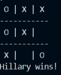

# tic_tac_toe_game
This is a 3x3 grid game played by two users where each user takes turns in playing. The one who gets 3 consecutive cells Wins!

## Game Play Details

The game board is, as shown above, a 3x3 grid where each player takes a turn and plays.

- The game starts by prompting both players for their names.
- We assume player one always starts, then player two
- Conventional symbols are ('x') for player one and ('o') for player two

##### There are four Winning possibilities for each player:

1) If a symbol ('x' or 'o') at any given point occupies an entire row
2) an entire column
3) if the symbol occupies the leading diagonal
4) or if the symbol occupies the antidiagonal.

 The first player to fulfill any of the above conditions is declared **Winner!**

##### Draw

There is a draw (or tie) if all cells are occupied without any player meeting the above conditions.

## Game Conditions

- A cell can either be empty or owned by a player
- A **valid move** is possible only when a cell is empty.
- An **input is valid** if it is either 1, 2, 3, 4, 5, 6, 7, 8, 9

## Project Description

The project was implemented in the following milestones:

**Milestone 1**
This was the setup milestone where we set up the necessary files for the project. The milestone was named **setup-feature**

**Milestone 2**
For this milestone, we designed our board, our 3x3 grid, and inserted randomly the symbols. The milestone was named  **user_interface-feature**

**Milestone 3**
This is where the actual implementation takes place, all considerations and assumptions for plays are done here:

- Create game and player classes to hold the attributes and methods
- Determine players name and symbol
- Check for valid input and moves
- Create Game Flow with each player taking turns
- Declare the winner or if nobody wins, a draw

The milestone was named  **game_logic-feature**

**Milestone 4**
The Gaming instructions were written. The milestone was named **readme_game_instructions-feature**

## Designed With
- Ruby
- Git
- Rubocop
- VS Code
## Contributing

Contributions, issues, and feature requests are welcome! Start by:
  - Forking the project
  - Cloning the project to your local machine
  - cd into the project directory
  - Run git checkout -b your-branch-name
  - Make your contributions
  - Push your branch up to your forked repository
  - Open a Pull Request with a detailed description of the development branch of the original project for a review

  ## Contributors

👤 **Pascal Byabasaija**

- Github: [Byabasaija](https://github.com/Byabasaija)
- Twitter: [Pascal](https://twitter.com/byabashaijapoet)
- LinkedIn: [Pascal Byabasaija](https://www.linkedin.com/in/pascal-byabasaija-80578814b/)

👤  **Hillary Okello**

- Github: [@HillaryOkello](https://github.com/HillaryOkello)
- Twitter: [@kellyhillary4](https://twitter.com/Kellyhillary4)
- LinkedIn: [Hillary Okello](https://www.linkedin.com/in/hillary-okello-b173101a4/)

## Show your support

Give a  ⭐️ if you like this project!
